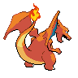

# Mini Project: PokeAPI Integration Project

**In this PokeAPI Integration project, you'll develop a web application that seamlessly integrates with the PokeAPI, providing users with an immersive experience into the world of Pokémon. Leveraging HTML, Bootstrap, CSS, and Asychronous JavaScript, you'll create a dynamic and interactive platform for exploring Pokémon data and information.**

## Project Requirements

**Homepage:
Design a visually appealing landing page with Bootstrap components and custom CSS styles.
Implement responsive design principles to ensure compatibility across various devices and screen sizes.**

**Pokémon Search Page:
Create a search page where users can enter a Pokémon's name or ID to retrieve relevant information.
Utilize JavaScript asynchronous functions to fetch data from the PokeAPI and dynamically update the webpage content based on user input.**

**Pokémon Details Page:
Develop a details page that displays comprehensive information about a specific Pokémon, including its abilities, types, stats, and image.
You can do this with cards, carousels, tables, and/or accordions with Bootstrap. 
Apply CSS styling to enhance the presentation of Pokémon details and ensure readability.**

### Start by creating a new HTML page name it index.html

#### use command bs5-$
**You should see the following**

```
<!doctype html>
<html lang="en">
  <head>
    <title>Title</title>
    <!-- Required meta tags -->
    <meta charset="utf-8" />
    <meta
      name="viewport"
      content="width=device-width, initial-scale=1, shrink-to-fit=no"
    />

    <!-- Bootstrap CSS v5.2.1 -->
    <link
      href="https://cdn.jsdelivr.net/npm/bootstrap@5.3.2/dist/css/bootstrap.min.css"
      rel="stylesheet"
      integrity="sha384-T3c6CoIi6uLrA9TneNEoa7RxnatzjcDSCmG1MXxSR1GAsXEV/Dwwykc2MPK8M2HN"
      crossorigin="anonymous"
    />
  </head>

  <body>
    <header>
      <!-- place navbar here -->
    </header>
    <main></main>
    <footer>
      <!-- place footer here -->
    </footer>
    <!-- Bootstrap JavaScript Libraries -->
    <script
      src="https://cdn.jsdelivr.net/npm/@popperjs/core@2.11.8/dist/umd/popper.min.js"
      integrity="sha384-I7E8VVD/ismYTF4hNIPjVp/Zjvgyol6VFvRkX/vR+Vc4jQkC+hVqc2pM8ODewa9r"
      crossorigin="anonymous"
    ></script>

    <script
      src="https://cdn.jsdelivr.net/npm/bootstrap@5.3.2/dist/js/bootstrap.min.js"
      integrity="sha384-BBtl+eGJRgqQAUMxJ7pMwbEyER4l1g+O15P+16Ep7Q9Q+zqX6gSbd85u4mG4QzX+"
      crossorigin="anonymous"
    ></script>
  </body>
</html>
```
#### From here we can add navbar, containers, forms and buttons to make a visually appealing home page, with search function.

```
<!doctype html>
<!doctype html>
<html lang="en">
    <head>
        <title>PokeAPI</title>
        <!-- Required meta tags -->
        <meta charset="utf-8" />
        <meta
            name="viewport"
            content="width=device-width, initial-scale=1, shrink-to-fit=no"
        />

        <!-- Bootstrap CSS v5.2.1 -->
        <link
            href="https://cdn.jsdelivr.net/npm/bootstrap@5.3.2/dist/css/bootstrap.min.css"
            rel="stylesheet"
            integrity="sha384-T3c6CoIi6uLrA9TneNEoa7RxnatzjcDSCmG1MXxSR1GAsXEV/Dwwykc2MPK8M2HN"
            crossorigin="anonymous"
        />
        <link rel="stylesheet" href="stylesheet.css">
        <script src="index.js" defer></script>
    </head>

    <body>
        <header>
            <!-- Navbar --> 
            <nav class="navbar navbar-expand-lg navbar-dark bg-dark">
                <div class="container">
                  <a class="navbar-brand text-warning" href="https://pokeapi.co/" src="charizard.png" target="_blank" width="50" height="50"><b>PokeDex</b></a>
                </div>
              </nav>
        </header>
        <main class="bg-dark">
```
#### In this Jumbotron we are adding pokemon search form and the container displaying PokeAPI data.

+ **We start by ctreating a form and giving it an id and an onSubmit event handler to call a function when the form is submitted**
+ **Then we add the input button we and an id with a placeholder "Enter a pokemon name or ID"**
+ **Next we add the input button**
+ **And finally we add the container to display PokeAPI data**
  
#### Example of our form:
```
<!-- Pokemon search form with button -->
<form id="pokemonSearch" 
onsubmit="handleSubmit(event)">
<input type="text" class="form-control 
text-center" id="pokemonInput" 
placeholder="Enter a Pokémon name or ID">
<button type="submit" 
class="move_btn btn btn-primary">Search</button>
</form>
<!-- Pokemon displayed -->
<div id="pokemonInfo">
</div>
```

```
          <!-- jumbotron -->
          <div class="jumbotron jumbotron-fluid bg-dark text-light text-center">
            <div class="container">
              <h1 class="display-4" style="color: gold;"><b>Welcome to PokeDex</b></h1>
              <p class="lead display-7" style="color: gold;"><b>What Pokemon are you searching for?</b></p>
              <!-- Pokemon search form with button -->
              <form id="pokemonSearch" onsubmit="handleSubmit(event)">
                <input type="text" class="form-control text-center" id="pokemonInput" placeholder="Enter a Pokémon name or ID">
                <button type="submit" class="move_btn btn btn-primary">Search</button>
              </form>
              <!-- Pokemon displayed -->
              <div id="pokemonInfo">
              </div>
            </div>
          </div>
```
####  From here we utilize javaScript to handle onSubmit function. 
```
// function to handle onSubmit
function handleSubmit(event) {
    event.preventDefault();

    // Get pokemon value log in console
    const pokemonInput = document.getElementById("pokemonInput").value
    console.log("https://pokeapi.co/api/v2/pokemon/", pokemonInput);
    pokemonSearch(pokemonInput);
}
```
####  From here we utilize javaScript asynchronous functions to fetch data from the PokeAPI map items then display data.
```
// Fetch data from API with try and catch
const pokemonSearch = async (pokemon) => {
    try{
       const res = await fetch(`https://pokeapi.co/api/v2/pokemon/${pokemon}`)
       const pokeData = await res.json();
       // console.log(data);
        
     // create function to callback this function
     // Display pokemon details
       const pokeInfo = document.getElementById('pokemonInfo');

       pokeInfo.innerHTML = `
        <h2>${pokeData.name}</h2>
        
        <h3>Abilities</h3>
        <ul>${pokeData.abilities.map(a => `<li>${a.ability.name}</li>`).join("")}
        </ul>
        <h3>Base Experience</h3>
        <p>${pokeData.base_experience}</p>

      
        <h3>Sounds:</h3>
        <audio src="${pokeData.cries.latest}" controls></audio>
        <audio src="${pokeData.cries.legacy}" controls></audio>
        `
 
    } catch{
        console.log(`Error fetching from API ${pokemon}`);
    }
   
}
```


```
          <!-- Card -->
          <div class="card-group">
            <div class="card p-3">
              <h5 class="card-title text-dark bg-warning w-50 text-center">Zapdos</h5>
              <p class="text-light">Lvl 98</p>
              <!-- Progress Bar -->
              <div class="progress">
                <div class="progress-bar progress-bar-striped progress-bar-animated" role="progressbar" aria-valuenow="75" aria-valuemin="0" aria-valuemax="100" style="width: 75%"></div>
              </div>
              
              <div class="card-body">
                <p class="card-electric text-center w-50">Electric</p>
                <p class="card-flying text-center w-50">Flying</p>
                <p class="card-text"><small class="text-muted">Last updated 3 mins ago</small></p>
                <a href="https://pokeapi.co/api/v2/pokemon/zapdos" target="_blank" class="btn btn-primary">Zapdos API</a>
                <!-- Ask about giving buttons active reactions -->
                <!-- Button Active hover-->
                <style>
                  .btn-primary:hover {
                     /* background-color: #964707;
                      border-color: #004085; */
                      box-shadow: 0 4px 8px rgba(0, 0, 0, 0.2);
                      transform: scale(1.1);
                      transition: all 0.2s;
                  }
                  </style>
                  <p class="abilities text-light text-center w-50 p-2 ">Abilities</p>
                <ul class="list-group list-group-flush">
                  <li class="list-group-item list-group-flush bg-warning">Sky-attack</li>
                  <li class="list-group-item list-group-flush bg-warning">Hyper-beam</li>
                  <li class="list-group-item list-group-flush bg-warning">Zap-cannon</li>
                </ul>
              </div>
            </div>
            <div class="card p-3">
              <h5 class="card-title text-dark bg-warning w-50 text-center">Pikachu</h5>
              <p class="text-light">Lvl 98</p>
              <!-- Progress Bar -->
              <div class="progress">
                <div class="progress-bar progress-bar-striped progress-bar-animated" role="progressbar" aria-valuenow="75" aria-valuemin="0" aria-valuemax="100" style="width: 75%"></div>
              </div>
              
              <div class="card-body">
                <p class="card-electric w-50 text-center">Electric</p>
                <p class="card-text"><small class="text-muted">Last updated 3 mins ago</small></p>
                <a href="https://pokeapi.co/api/v2/pokemon/pikachu" class="btn btn-primary" target="_blank">Pikachu API</a>
                <ul class="list-group list-group-flush">
                  <p class="abilities text-light text-center w-50 p-2 ">Abilities</p>
                  <li class="list-group-item list-group-flush bg-warning">Thunder</li>
                  <li class="list-group-item list-group-flush bg-warning">Thunder-punch</li>
                  <li class="list-group-item list-group-flush bg-warning">Thunder-wave</li>
                </ul>
              </div>
            </div>
            <div class="card p-3">
              <h5 class="card-title text-dark bg-warning w-50 text-center">Darkrai</h5>
              <p class="text-light">Lvl 98</p>
              <!-- Progress Bar -->
              <div class="progress">
                <div class="progress-bar progress-bar-striped progress-bar-animated" role="progressbar" aria-valuenow="75" aria-valuemin="0" aria-valuemax="100" style="width: 75%"></div>
              </div>
              
              <div class="card-body">
                <p class="card-dark w-50 text-light text-center">Dark</p>
                <p class="card-text"><small class="text-muted">Last updated 3 mins ago</small></p>
                <a href="https://pokeapi.co/api/v2/pokemon/darkrai" class="btn btn-primary" target="_blank">Darkrai API</a>
                <p class="abilities text-light text-center w-50 p-2 ">Abilities</p>
                <ul class="list-group list-group-flush">
                  <li class="list-group-item list-group-flush bg-warning">Ice-beam</li>
                  <li class="list-group-item list-group-flush bg-warning">Hypnosis</li>
                  <li class="list-group-item list-group-flush bg-warning">Dream-eater</li>
                </ul>
              </div>
            </div>
            <div class="card p-3">
              <h5 class="card-title text-dark bg-warning w-50 text-center">Mew</h5>
              <p class="text-light">Lvl 98</p>
              <!-- Progress Bar-->
              <div class="progress">
                <div class="progress-bar progress-bar-striped progress-bar-animated" role="progressbar" aria-valuenow="75" aria-valuemin="0" aria-valuemax="100" style="width: 75%"></div>
              </div>
              
              <div class="card-body">
                <p class="card-psychic w-50 text-light text-center">Psychic</p>
                <p class="card-text"><small class="text-muted">Last updated 3 mins ago</small></p>
                <a href="https://pokeapi.co/api/v2/pokemon/mew" class="btn btn-primary" target="_blank">Mew API</a>
                <p class="abilities text-light text-center w-50 p-2 ">Abilities</p>
                <ul class="list-group list-group-flush">
                  <li class="list-group-item list-group-flush bg-warning">Mega-drain</li>
                  <li class="list-group-item list-group-flush bg-warning">Psybeam</li>
                  <li class="list-group-item list-group-flush bg-warning">Calm-mind</li>
                </ul>
              </div>
            </div>
            <div class="card p-3">
              <h5 class="card-title text-dark bg-warning w-50 text-center">Rayquaza</h5>
              <p class="text-light">Lvl 98</p>
              <!-- Progress Bar -->
              <div class="progress">
                <div class="progress-bar progress-bar-striped progress-bar-animated" role="progressbar" aria-valuenow="75" aria-valuemin="0" aria-valuemax="100" style="width: 75%"></div>
              </div>
                
                <div class="card-body">
                  <p class="card-dragon w-50 text-light text-center">Dragon</p>
                  <p class="card-flying w-50 text-center">Flying</p>
                  <p class="card-text"><small class="text-muted">Last updated 3 mins ago</small></p>
                  <a href="https://pokeapi.co/api/v2/pokemon/rayquaza" class="btn btn-primary" target="_blank">Rayquaza API</a>
                  <p class="abilities text-light text-center w-50 p-2 ">Abilities</p>
                  <ul class="list-group list-group-flush">
                    <li class="list-group-item list-group-flush bg-warning">Flamethrower</li>
                    <li class="list-group-item list-group-flush bg-warning">Solar-beam</li>
                    <li class="list-group-item list-group-flush bg-warning">Outrage</li>
                  </ul>
                </div>
              </div>
          </div>
          
            <!-- Main Content -->
            <div style="background-image: url(https://raw.githubusercontent.com/PokeAPI/sprites/master/sprites/pokemon/other/showdown/shiny/802.gif);" class=".container-fluid m-1">
                <div class="row">
                  <div style="background-image: url(background.jpg);" class="sidebar col-sm-2 bg-primary p-3 ">
                    <h5 class="text-center text-decoration-underline text-light">Poke Info</h5>
                    <div class="d-flex flex-column bd-highlight mb-3">
                    <!-- toast button!-->
                    <button type="button" class="btn btn-primary" id="liveToastBtn">Show Pokemon</button>
                    <!-- toast container -->
                    <div class="toast-container position-fixed bottom-0 end-0 p-3">
                        <div id="liveToast" class="toast" role="alert" aria-live="assertive" aria-atomic="true">
                           <div class="toast-header">
                                
                                    <strong class="me-auto">Type: Fire</strong>
                                    <small>1 mins ago</small>
                                    <button type="button" class="btn-close" data-bs-dismiss="toast" aria-label="Close"></button>
                             </div>
                            <div class="toast-body">
                                    Pokemon: Charizard
                           </div>
                      </div>
                      <!-- Toast activator-->
                      <script>
                        const toastTrigger = document.getElementById('liveToastBtn')
                        const toastLiveExample = document.getElementById('liveToast')
                        if (toastTrigger) {toastTrigger.addEventListener('click', () => 
                        {const toast = new bootstrap.Toast(toastLiveExample)
                          toast.show()})
                        }
                      </script>
                    </div>
                        <div class="p-2 bd-highlight text-light text-center">Pokemon</div>
                      </div>
                      <div class="d-flex bd-highlight">
                        <div class="p-2 bd-highlight"></div>
                        <div class="p-2 bd-highlight"></div>
                        <div class="p-2 bd-highlight"></div>
                      </div>
                  </div>
                  <!-- Main container -->
                  <div class="col-sm-8 p-3">
                    <div>
                            <h5 class="text-light text-center"><b>Legendary/Mythical Pokemon:</b></h5>
                            <!-- Carousel -->
<div id="carouselExampleCaptions" class="carousel slide" data-bs-ride="carousel">
  <div class="carousel-indicators">
    <button type="button" data-bs-target="#carouselExampleCaptions" data-bs-slide-to="0" class="active" aria-current="true" aria-label="Slide 1"></button>
    <button type="button" data-bs-target="#carouselExampleCaptions" data-bs-slide-to="1" aria-label="Slide 1"></button>
    <button type="button" data-bs-target="#carouselExampleCaptions" data-bs-slide-to="2" aria-label="Slide 2"></button>
    <button type="button" data-bs-target="#carouselExampleCaptions" data-bs-slide-to="3" aria-label="Slide 3"></button>
  </div>
  <div class="carousel-inner">
    <div class="carousel-item active">
      
      <div class="carousel-caption d-none d-md-block text-light" style="height: 100px;">
        <h5>Zapdos</h5>
        <p><b>is a legendary bird Pokémon that has the ability to control electricity. It usually lives in thunderclouds. It gains power if it is stricken by lightning bolts.</b></p>
      </div>
    </div>
    <div class="carousel-item">
      
      <div class="carousel-caption d-none d-md-block text-light">
        <h5>Darkrai</h5>
        <p><b>is a black, shadow-like Pokémon. It has a small head with a white fog-like ghostly plume billowing from its head covering one of its bright blue eyes, with the portion on its face resembling hair. It also has a red spiky growth around its neck.</b></p>
      </div>
    </div>
    <div class="carousel-item">
      
      <div class="carousel-caption d-none d-md-block text-light">
        <h5>Mew</h5>
        <p><b>is said to possess the genetic composition of all Pokémon. It is capable of making itself invisible at will, so it entirely avoids notice even if it approaches people. A Pokémon of South America that was thought to have been extinct. It is very intelligent and learns any move.</b></p>
      </div>
    </div>
    <div class="carousel-item">
      
      <div class="carousel-caption d-none d-md-block text-light">
        <h5>Rayquaza</h5>
        <p><b>is a dual-type Dragon/Flying Legendary Pokémon introduced in Generation III. While it is not known to evolve into or from any other Pokémon, Rayquaza can Mega Evolve into Mega Rayquaza if it knows Dragon Ascent, but only if it is not holding a Z-Crystal.</b></p>
      </div>
    </div>
  </div>
  <button class="carousel-control-prev" type="button" data-bs-target="#carouselExampleCaptions" data-bs-slide="prev">
    <span class="carousel-control-prev-icon" aria-hidden="true"></span>
    <span class="visually-hidden">Previous</span>
  </button>
  <button class="carousel-control-next" type="button" data-bs-target="#carouselExampleCaptions" data-bs-slide="next">
    <span class="carousel-control-next-icon" aria-hidden="true"></span>
    <span class="visually-hidden">Next</span>
  </button>
</div>
                           
                        </ul>
                    </div>
                  </div>
                  <!-- Advertizement right sidebar-->
                  <div style="background-image: url(background.jpg);" class="sidebar col-sm-2 bg-info p-3">
                  </div>
                </div>
            </div>
              <br>
              <!-- New Section -->
              <section class="">
                <!-- Bear logo animated -->
              <div class="container-fluid bg-dark text-light" style="background-image: url(https://raw.githubusercontent.com/PokeAPI/sprites/master/sprites/pokemon/other/showdown/shiny/802.gif);">
                <div class="row">
                  <div class="col">
                    
                    <h1 class="text-center text-warning">Pokemon Battle</h1><br>
                    <h3 class="text-center text-warning">Pokemon</h3>
                  </div>
                </div>
              </div>
                </div>
              </section>
              </div>
        </main>
        <footer>
            <!-- place footer here -->
            <p>&copy; 2024 Zabdiel Perez. All rights reserved.</p>
        </footer>
            <script src="https://cdn.jsdelivr.net/npm/bootstrap@5.2.3/dist/js/bootstrap.bundle.min.js"></script>
            
    </body>
</html>
```

